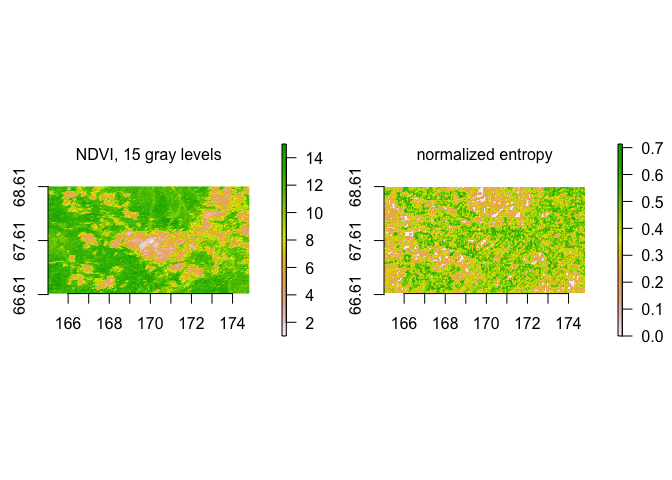

<!-- README.md is generated from README.Rmd. Please edit that file -->

# StrucDiv

<!-- badges: start -->
<!-- badges: end -->

The `StrucDiv` package provides methods to quantify spatial structural
diversity, hereafter structural diversity, in raster data. Raster data
means data in gridded field format. The methods consider the spatial
arrangement of pixels as pairs, based on Haralick, Shanmugam, and
Dinstein (1973). Pixels are considered as pairs at user-specified
distances and angles. Distance refers to the distance between the two
pixels that are considered a pair. Angle refers to the angle at which
two pixels are considered a pair. Angles can be horizontal or vertical
direction, or the diagonals at 45° or 135°. the direction-invariant
version considers all angles at the same time. The frequencies of pixel
pair occurrences are normalized by the total number of pixel pairs,
which returns the gray level co-occurrence matrix (GLCM). The total
number of pixel pairs depends on the extent of the area under
consideration, i.e. on the spatial scale. the spatial scale is defined
by the window side length (WSL) of a moving window. In each GLCM, pixel
values can be replaced with ranks. Diversity metrics are calculated on
every element of the GLCM, and their sum is assigned to the center pixel
of the moving window and represents spatial structural diversity of the
window. The output map is called a ‘structural diversity map.’ Diversity
metrics include common second-order texture metrics: contrast,
dissimilarity, homogeneity and entropy (i.e. Shannon entropy).
Additionally, structural diversity entropy includes a difference weight
*δ* ∈ {0, 1, 2}, which weighs the difference between pixel values
v<sub>*i*</sub> and v<sub>*j*</sub>, either by absolute, or by squared
differences. When *δ* = 0, structural diversity entropy corresponds to
Shannon entropy. Additionally, normalized entropy is available.
Normalized entropy is Shannon entropy normalized over maximum entropy,
which depends on the spatial scale. These methods can be applied to any
continuous data in raster format, and also to categorical data if
categories are numbered in a meaningful way, or if entropy or normalized
entropy are used. For entropy, normalized entropy, and homogeneity, high
numbers of gray levels lead to structureless diversity maps. With these
methods, structural diversity features can be detected. Structural
diversity features have also been called latent landscape features.

## Installation

You can install the released version of StrucDiv from
[CRAN](https://CRAN.R-project.org) with:

``` r
install.packages("StrucDiv")
```

## Example

Calculate normalized entropy on Normalized Difference Vegetation Index
(NDVI) data, which was binned to 15 gray levels (see data
documentation). We define the size of the moving window with WSL three,
and we consider distance one between pixels (direct neighbors), and all
four possible directions in which pixels can be considered as pairs.

``` r
entNorm <- StrucDiv(ndvi.15gl, wsl = 5, dist = 1, angle = "all", fun = entropyNorm, na.handling = na.pass)
```



<div id="refs" class="references csl-bib-body hanging-indent">

<div id="ref-Haralick1973" class="csl-entry">

Haralick, R. M., K. Shanmugam, and I. Dinstein. 1973. “Textural Features
for Image Classification.” *IEEE Transactions on Systems, Man, and
Cybernetics* SMC-3 (6): 610–21.
<https://doi.org/10.1109/TSMC.1973.4309314>.

</div>

</div>
